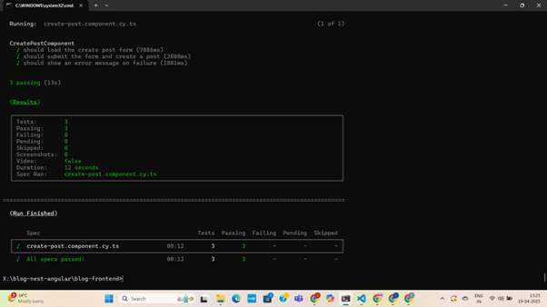

# Angular Blog Frontend

This is the frontend application built using **Angular** that is integrated with the **NestJS Blog Backend API**. The app provides a platform for users to log in via **Google OAuth** or **Facebook OAuth**, view and manage posts, and create new posts. It also includes pagination, post details in popups, and an intuitive dashboard to manage posts.

---

## 🚀 Features

1. **OAuth Authentication**
   - Login using **Google OAuth** or **Facebook OAuth**.
   - After successful login, users are redirected to the **Dashboard**.

2. **Dashboard**
   - Displays all public posts with **pagination**.
   - Each post is clickable, and a **popup** shows the post details.
   - Includes a top bar with:
     - **Create Post** button.
     - **My Posts** section, where users can manage their posts.

3. **My Posts**
   - Users can **edit** or **delete** posts they have created.
   
4. **Create Post**
   - A form to create a new post, including title, content, and visibility.
   - Integrated with the backend to save posts.

5. **API Integration**
   - Integrated with the **NestJS Blog API** for managing posts (CRUD operations).
   - All posts and user authentication are handled through API calls.

6. **End-to-End Testing**
   - **Cypress** is used for E2E testing.
   - The test for creating a post is located in `cypress/e2e/create-post.component.cy.ts`.

---

## 🛠️ Setup & Installation

### 1. Install Dependencies
In the root of the Angular project, run the following command to install dependencies:
```bash

npm install
4. Run the Angular Application
Once the backend is up and running, navigate to the Angular project directory and run:

bash
Copy
Edit
# Navigate to the Angular project directory
cd path/to/angular-frontend

# Serve the Angular application
ng serve
This will start the Angular frontend on http://localhost:4200. The app will be available to use in the browser.

🔑 Authentication
Upon loading the application, users are prompted with a login screen.

Users can choose to log in via either Google OAuth or Facebook OAuth.

Once authenticated, they are redirected to the Dashboard, where they can see public posts and manage their own posts.

📋 Dashboard Features
Pagination: Displays posts in a paginated format. Users can navigate through the posts using the pagination controls.

Post Details: Clicking on a post shows its detailed content in a popup.

Create Post: Users can create new posts via a form. The form takes in the post title, content, and visibility.

My Posts: The My Posts section displays posts created by the user. Each post has options to edit or delete.

🛠️ Project Structure
The Angular project is well-structured into modules for maintainability:

Modules:
Auth Module: Handles user authentication with Google and Facebook OAuth.

Posts Module: Manages post-related features like viewing, creating, and editing posts.

Layout Module: Contains the layout for the app, including the dashboard and UI components like the top bar and post cards.

Environment Configuration:
The src/environments folder contains the environment files with API URLs and OAuth credentials.

🧪 End-to-End Testing with Cypress
Cypress is used for E2E testing, and the test for creating posts is located in the following file:

bash
Copy
Edit
cypress/e2e/create-post.component.cy.ts
To Run the Cypress Tests:
Install Cypress dependencies:

bash
Copy
Edit
npm install cypress --save-dev
Open Cypress test runner:

🏗️ Build the Angular Project
To build the project for production, run the following command:

bash
Copy
Edit
ng build --prod
This will build the Angular app with optimizations for production.

🔧 Technologies Used
Frontend: Angular 12+, TypeScript

Backend: NestJS (for API integration)

Authentication: Google OAuth, Facebook OAuth

Testing: Cypress for E2E tests

Pagination: Integrated with backend API to paginate public posts

🛠️ Developer Notes
Ensure that the backend is running before starting the frontend.

OAuth credentials need to be added to the environment.ts file to enable login functionality.

The API URL (http://localhost:3000/api) should point to the running backend server.

🧪 Create Post Integration Test (Cypress)
We use Cypress to run an end-to-end integration test for the Create Post feature. This ensures that the entire flow — from filling the form to successfully submitting a post — works as expected in a live environment.

Test file:

bash
Copy
Edit
cypress/e2e/create-post.component.cy.ts
✅ This test simulates a user creating a post through the UI and validates that it's properly submitted and visible in the dashboard.

🚀 How to Run the Integration Test
Make sure both the frontend and backend servers are running:

Frontend → ng serve

Backend → npm run start

Then run this command to execute the test:

bash
Copy
Edit
npx cypress run --e2e --spec "cypress/e2e/create-post.component.cy.ts"
This command:

Runs Cypress in headless mode (no UI).

Targets the specific test file for the Create Post feature.

Prints results directly in the terminal.


